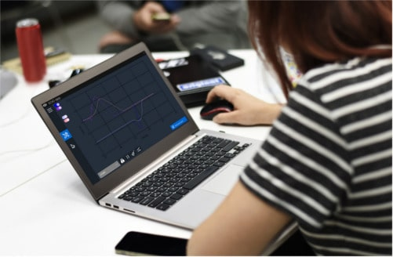

<!-- PROJECT LOGO -->
 

  

  <h3 align="center">EOG App</h3>

  

    A solution to capture eye movements and show them on screen
     
    <a href="https://github.com/ronaldosena/eogapp/commits/"><strong>Explore the code »</strong></a>
     
    <a href="https://github.com/ronaldosena/eogapp/issues">Report Bug</a>
    ·
    <a href="https://github.com/ronaldosena/eogapp/LICENSE.md">View License</a>
  

## About The Project

[![EOG App][demo-gif]](https://github.com/ronaldosena/eogapp)

This was a college project that captures eye movements and displayed them on the screen. The goal was to control a mouse pointer just with your eye movement. In this repo, you will find both the firmware and the desktop app that I used. As for the electronic circuit, it was a standard instrumentation amplifier tunned for electrical signals from eye muscles.

### Built With

- [.NET Framework](https://dotnet.microsoft.com/en-us/download/dotnet-framework)
- [Winforms](https://github.com/dotnet/winforms)
- [Arduino](https://www.arduino.cc/)

<!-- CONTRIBUTING -->

## Contributing

Well, unfortunatly, this project is no longer supported. Just for archive and consulting porpouses only.

<!-- LICENSE -->

## License

Distributed under the Coffeware License. See [`LICENSE.md`](https://github.com/ronaldosena/eogapp/LICENSE.md) for more information.

<!-- CONTACT -->

## Contact

You can reach me out at [@roronalds\_](https://twitter.com/roronalds_) or send an e-mail to ronaldo.sena@outlook.com

<a href="#top">back to top</a>

<!-- MARKDOWN LINKS & IMAGES -->

[demo-gif]: assets/m-eog-app.png
